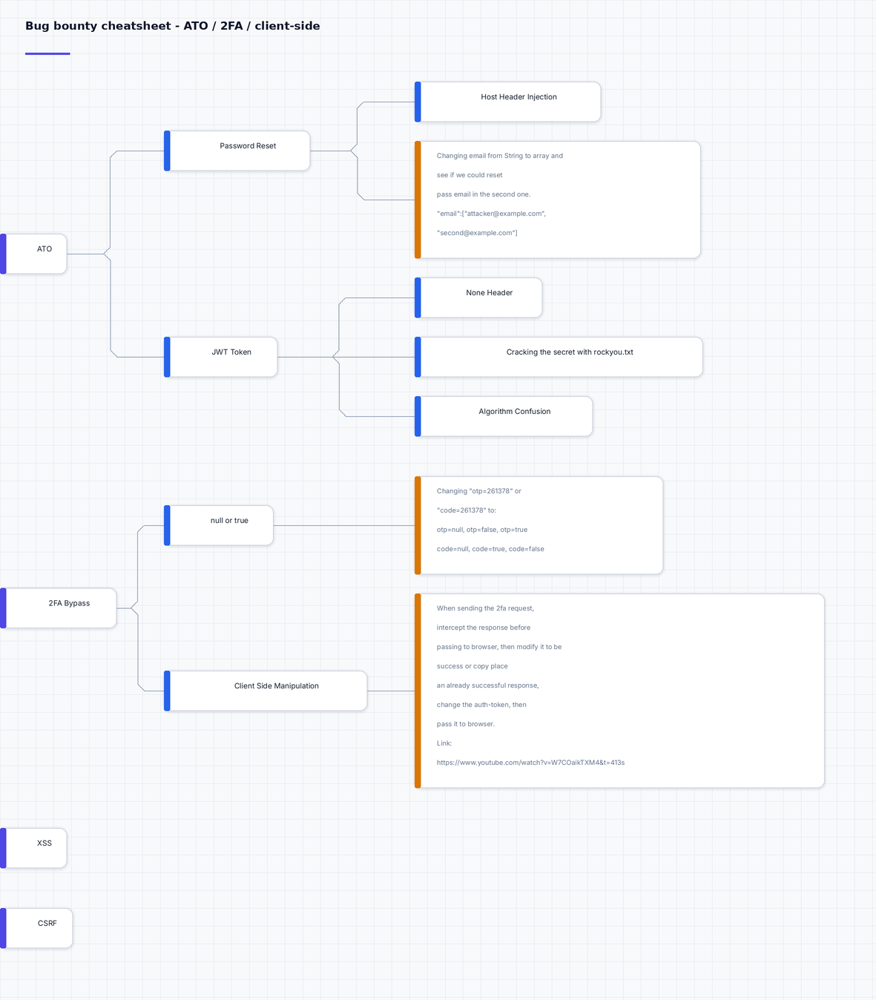
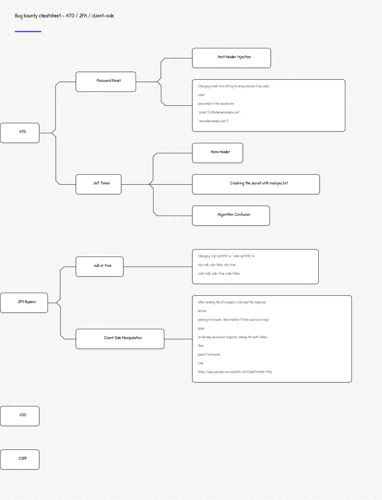

# triogma

Security diagramming tooling — turn an indented outline of a testing methodology, attack
tree, or findings map into a clean board you can edit visually and export as a PNG.

Built for bug-bounty and pentest workflow notes: fast to write as text, fast to refine as
a diagram, and it renders something presentable enough to drop into a report.

```
outline (.txt)  ──►  board.json  ──┬──►  render.py  ──►  .png
                                   └──►  GUI editor (boards.py)
```

`board.json` is the single source of truth. The browser editor and the renderer read the
same file, so the diagram and the image never drift apart.

| `pro` scheme | `hand` scheme |
| --- | --- |
|  |  |

## Features

- **Two visual schemes**
  - `pro` — Inter typography, tinted canvas, hairline grid, soft shadows, per-type accent rails
  - `hand` — handwriting font, dotted canvas, the whiteboard/excalidraw look
- **Auto-layout** — nodes position themselves from the tree; no manual coordinates
- **Auto-sizing cards** — boxes grow to fit their text, notes wrap at a readable width
- **Visual editor** — drag, connect, recolour, edit text in the browser
- **No cloud, no accounts** — everything runs on localhost

## Requirements

Python 3.9+ and Pillow:

```bash
pip install pillow
```

## Quick start

```bash
# outline -> board JSON
python3 triogma/from_outline.py examples/ato.txt board.json --scheme pro

# board JSON -> PNG
python3 triogma/render.py board.json board.png --scheme pro
```

Convert an existing `board.json` in the browser instead:

```bash
python3 triogma/boards.py --port 8790 --board board.json
# then open http://127.0.0.1:8790/
```

## The visual editor

| Action | How |
| --- | --- |
| Add a card | **+ Box** / **+ Note** |
| Move a card | drag it |
| Edit text | double-click the card |
| Link two cards | **Connect**, then click both |
| Recolour | Inspector → accent swatches |
| Change type | Inspector → type dropdown (`root`, `box`, `note`, `good`, `bad`) |
| Delete | select, press <kbd>Del</kbd> |
| Save | **Save** or <kbd>Ctrl</kbd>+<kbd>S</kbd> |
| Re-render | **Render PNG** |
| Download JSON | **Export** |

Accent colours are meaningful rather than decorative — `good`/`bad` let you mark confirmed
findings against dead ends on the same board.

## Outline syntax

Two spaces is one level.

```
ATO
  Password Reset
    Host Header Injection
    [note] Changing email from String to array may reset
           the second address.
  JWT Token
    - None Header
    - Algorithm Confusion
```

| Line | Result |
| --- | --- |
| `Text` | a box — a parent if it has indented children |
| `- Text` | a leaf box |
| `[note] Text` | a note card; following lines indented to the marker stay in the note |
| `# ...` | comment |
| `title: ...` | board title |

## Board JSON

```json
{
  "title": "My board",
  "scheme": "pro",
  "nodes": [
    { "id": "n1", "label": "Password Reset", "kind": "box", "x": 200, "y": 120 }
  ],
  "edges": [ { "from": "n1", "to": "n2" } ]
}
```

- `kind`: `root` | `box` | `note` | `good` | `bad`
- `x` / `y` are optional — omit them and the tree layout assigns positions
- `w` / `h` are optional — omit them and cards auto-size to their text
- `color`: optional hex accent overriding the type default

## Files

| Path | Purpose |
| --- | --- |
| `triogma/from_outline.py` | indented outline → board JSON |
| `triogma/render.py` | board JSON → PNG (`pro` / `hand`) |
| `triogma/boards.py` | localhost editor server + JSON API |
| `triogma/ui.html` | the editor UI |
| `triogma/fonts/` | Inter and Patrick Hand |

## License

MIT — see [LICENSE](LICENSE).
